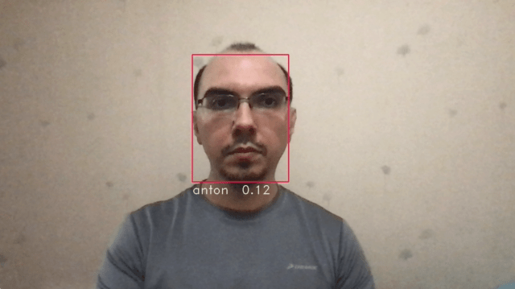

# Российский университет дружбы народов
Факультет физико-математических и естественных наук. Очно-заочное обучение.  
Группа НПМбв01-17. Шестаков А.В

## Распознавание лица в режиме реального времени
Проект выполнен на языке Python с использованием Tensorflow 2.x, MTCNN и весов предварительно обученной FaceNet модели [David Sandberg](https://github.com/davidsandberg)

### Краткая инструкция по использованию

1. Записать короткое видео со своим лицом, используя ```capture.py```. Для выхода нажать ```q``` на клавиатуре.
2. Обучить модель, запустив ``` train.py```.
3. Для распознавания лиц запустить ```recognize.py```. Для выхода нажать ```q``` на клавиатуре.

 <br>
